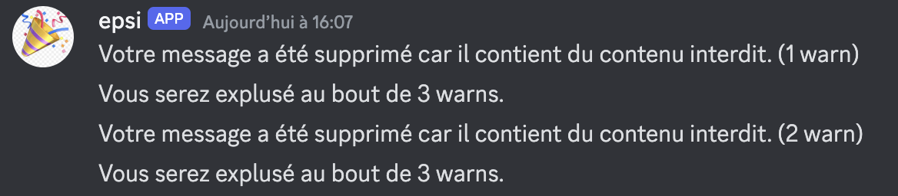

# TP : Développement d’un BOT avec l’API discord

## Liste des commandes 

- !joke : renvoie un blague récupéré sur l'API : https://v2.jokeapi.dev/joke/Any?lang=fr
- !welcome : Renvoie un message sur le serveur pour souhaiter la bienvenue au nouvel arrivant
- !touché : qui renvoie coulé ! avec un emoji
- !ping : qui renvoie pong avec un emoji
- !members : renvoie les informations sur les membres du serveur avec leurs rôles (bot exclue)

## Informations 

- Expulsition du serveur si vous envoyez plusieurs fois un mot bannis (Vous pouvez tester cette fonctionnalités avec le mot : insulte)
- Si vous envoyez 'bonjour', le bot mettra un emoji à votre message
- Lorsque vous rejoignez le serveur, il y a un message de bienvenue
- Vous pouvez retrouver la liste des môts bannis dans la variable BLACK_LIST

